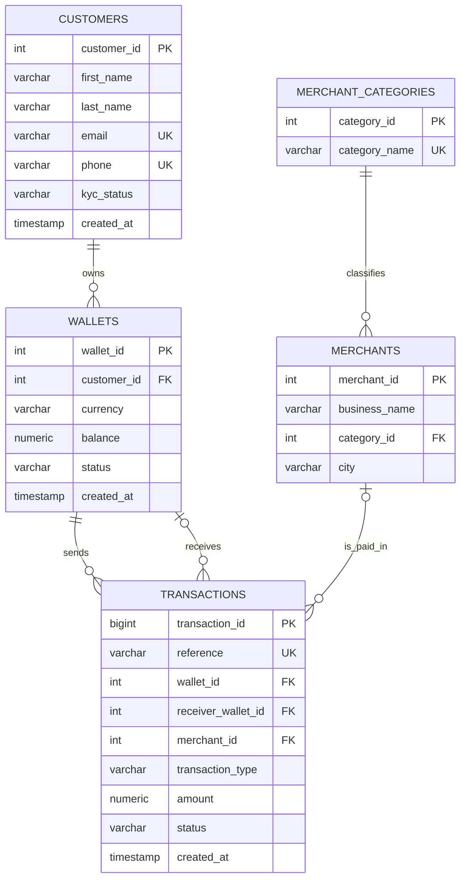

# Entity Relationship Diagram

```mermaid
erDiagram
    CUSTOMERS ||--o{ WALLETS : owns
    WALLETS ||--o{ TRANSACTIONS : sends
    WALLETS |o--o{ TRANSACTIONS : receives
    MERCHANT_CATEGORIES ||--o{ MERCHANTS : classifies
    MERCHANTS |o--o{ TRANSACTIONS : is_paid_in

    CUSTOMERS {
        int customer_id PK
        varchar first_name
        varchar last_name
        varchar email UK
        varchar phone UK
        varchar kyc_status
        timestamp created_at
    }
    WALLETS {
        int wallet_id PK
        int customer_id FK
        varchar currency
        numeric balance
        varchar status
        timestamp created_at
    }
    MERCHANT_CATEGORIES {
        int category_id PK
        varchar category_name UK
    }
    MERCHANTS {
        int merchant_id PK
        varchar business_name
        int category_id FK
        varchar city
    }
    TRANSACTIONS {
        bigint transaction_id PK
        varchar reference UK
        int wallet_id FK
        int receiver_wallet_id FK
        int merchant_id FK
        varchar transaction_type
        numeric amount
        varchar status
        timestamp created_at
    }
```
